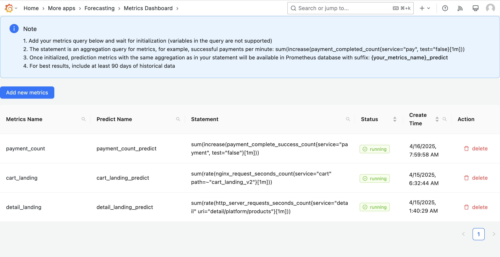

# Skyline Forecasting Platform

Skyline Forecasting Platform is a powerful time series prediction tool specifically designed for Grafana.

## Key Features

- **High-Precision Predictive Analytics**: Generate highly accurate forecasts based on historical data patterns, enabling proactive trend identification and risk mitigation
- **Real-Time Anomaly Detection**: Continuously monitor data streams to instantly identify deviations from expected patterns and trigger immediate alerts
- **Customizable Configuration**: Support for diverse data sources and advanced prediction models that can be tailored to specific business requirements for optimal results
- **On-Premises Deployment**: Engineered specifically for internal network environments to ensure sensitive data remains within your secure infrastructure
- **Seamless Grafana Integration**: Perfectly integrates with Grafana dashboards, providing intuitive visualization and interactive experiences



## Getting Started
**Note: This platform is designed for on-premises deployment in internal network environments. All data processing occurs within your infrastructure, ensuring sensitive data remains secure and never leaves your network.**

##### 1\. Install Skyline Forecasting Server  <br>
**System Requirements:**
- **Recommended Hardware**: High-performance server with GPU support for optimal prediction performance
- **Minimum Requirements**: 4 CPU cores, 16GB RAM, 40GB storage
- **Optimal Configuration**: 16+ CPU cores, 32GB+ RAM, NVIDIA GPU (at least 8GB VRAM), 40GB+ SSD storage
- **Operating System**: Linux (recommended)

<br> Prepare a Docker environment, install MySQL database, and provide MySQL configuration to the forecasting server through environment variables. Start the server using the script:  <br>

```
#!/bin/bash
docker pull skylinecorp/forecasting:latest
docker run -d -p 80:80 --name forecasting-container \
  -e PYTHONUNBUFFERED=1 \
  -e DB_HOST={your_mysql_host} \
  -e DB_PORT={your_mysql_port} \
  -e DB_USER={your_mysql_username} \
  -e DB_PASSWORD={your_mysql_password} \
  -e DB_NAME={your_mysql_database} \
  skylinecorp/forecasting:latest

```
Or start with docker-compose:
```
version: '3.8'

services:
  forecasting-app:
    image: skylinecorp/forecasting:latest
    container_name: forecasting-container
    environment:
      - PYTHONUNBUFFERED=1
      - DB_HOST={your_mysql_host}
      - DB_PORT={your_mysql_port}
      - DB_USER={your_mysql_username}
      - DB_PASSWORD={your_mysql_password}
      - DB_NAME={your_mysql_database}
    ports:
      - "80:80"
    restart: unless-stopped
```
##### 2\. Install skyline forecasting plugin  <br>
Record the domain name or IP address of the forecasting server you just started. When starting the Grafana server, pass the forecasting server address as an environment variable to Grafana using the following command: (The pluginsDir can be customized accordingly)
```
grafana cli --pluginsDir ./data/plugins --pluginUrl https://github.com/skyline-intelligence/forecasting/releases/download/v1.13.0/skylineintelligence-forecasting-app-1.13.0.zip --insecure plugins install skylineintelligence-forecasting-app

export GF_PLUGINS_FORECASTING_SERVER={your_forecasting_server_address}
./bin/grafana server
```
If you're using docker-compose, use the following configuration:

Create a Dockerfile with the following content:
```
FROM grafana/grafana:latest

USER root
RUN mkdir -p /var/lib/grafana/plugins
RUN grafana cli --pluginsDir /var/lib/grafana/plugins --pluginUrl https://github.com/skyline-intelligence/forecasting/releases/download/v1.13.0/skylineintelligence-forecasting-app-1.13.0.zip --insecure plugins install skylineintelligence-forecasting-app

USER grafana
```

Create a docker-compose.yml file with the following content:
```
version: '3.8'
services:
  grafana:
    build: 
      context: .
      dockerfile: Dockerfile
    container_name: grafana-container
    environment:
      - GF_PLUGINS_FORECASTING_SERVER={your_forecasting_server_address}
    ports:
      - "3000:3000"
    restart: unless-stopped
```
##### 3\. Enable skyline forecasting plugin  <br>
- Log in to Grafana with administrator credentials, click on the Plugins option in the left sidebar menu.
- In the Plugins page, search for "forecasting", then click on the forecasting plugin that appears in the search results.
- Click the Enable button in the upper right corner to activate the forecasting plugin. After enabling the plugin, you can proceed to configure it.

##### 4\. Configure Metrics Query and Write Addresses  <br>
In the configuration page, set up the addresses for querying and writing metrics. Authentication methods include username+password and token.  <br>
- For example, Prometheus query address: https://localhost:9090/api/v1/query_range   <br>
- For example, Prometheus write address: https://localhost:9090/api/v1/push     <br>

##### 5\. After completing the configuration, click save. Engineers can now add metrics that need to be predicted on the Metrics Dashboard page.


## Technical Support

For technical support, please contact our team at:
support@skyline-intelligence.com
